# CLD - LAB02 : App Scaling On Amazon Web Services

**Group U : A. David, T. Van Hove**

**Date : 06.04.2023**

**Teacher : Prof. Marcel Graf**

**Assistant : Rémi Poulard**

## Table of contents

[TOC]


## Introduction


This document contains all the deliverables of the laboratory #2 of the CLD course. We will not include the precise procedure followed by our group along the lab, however, we will discuss some elements and configurations about this laboratory.

## Create a database using RDS

In this task, we had to create and configure a AWS RDS instance that runs MySQL 8.0.27.

## Deliverable 1

### 1.1 Estimated monthly cost for the database

Firstly, we will explore some of the features available when choosing an AWS RDS instance.

#### On demand vs reserved RDS instances

> In terms of compute options and configurations, Reserved Instances and On Demand instances are the same. The only difference between the two is that a Reserved Instance is one you rent (“reserve”) for a fixed duration, and in return you receive a discount on the base price of an On Demand instance.
>
> The issue with AWS On Demand vs. Reserved Instance Pricing is that Standard Reserved Instance pricing is fixed. If prices are reduced during the life of a one or three year contract (as they have been year-on-year during the past decade), customers see no benefit from the price reduction and are committed to paying the Reserved Instance price for the duration of the contract.
>
>  [Source](https://blogs.vmware.com/cloudhealth/aws-reserved-instances-vs-on-demand/)

Our RDS instance is an on demand one.

#### DB instance classes

The DB instance class determines the computation and memory capacity of an Amazon RDS DB instance. A DB instance class consists of both the DB instance type and the size. In our case we selected the db.t3.micro. It provides a baseline performance level, with the ability to burst to full CPU usage. These instance classes provide more computing capacity than the previous db.t2 instance classes. They are powered by the AWS Nitro System, a combination of dedicated hardware and lightweight hypervisor.

#### Single vs Multi AZ deployment

> Failures are rare, but as a best practice, applications should design around potential failures. The RDS Multi-AZ configuration is the recommended approach for production environments due to its ability to support low *RTO* (recovery time objective) and *RPO* (recovery point objective) requirements. RTO is the targeted amount of time for a recovery to complete in the event of failure. RPO is the targeted amount of time during which data is at risk for loss in the event of a failure.
>
> [Source](https://aws.amazon.com/blogs/database/amazon-rds-under-the-hood-single-az-instance-recovery/)

> In an Amazon RDS Multi-AZ deployment, Amazon RDS automatically creates a primary database (DB) instance and synchronously replicates the data to an instance in a different AZ. When it detects a failure, Amazon RDS automatically fails over to a standby instance without manual intervention.
>
> 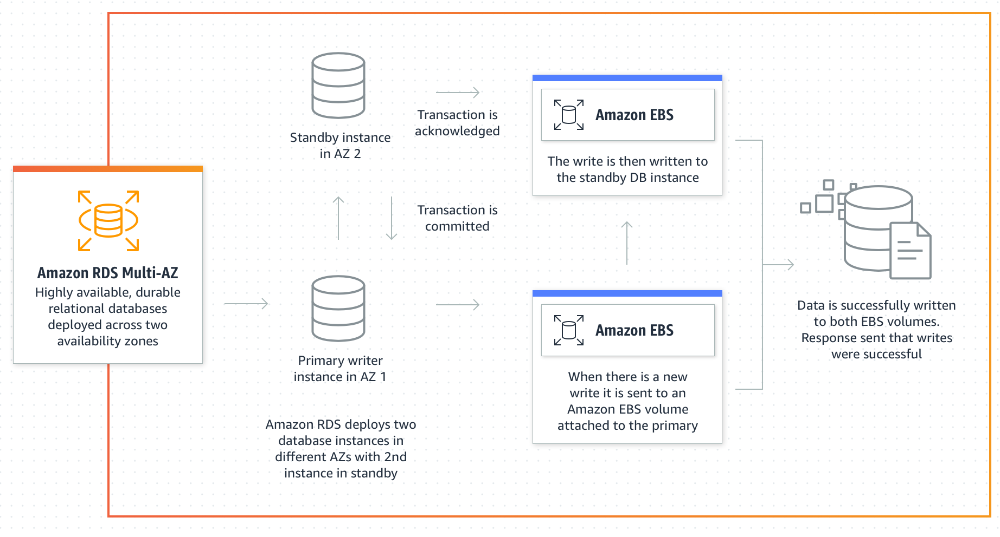
>
> [Source](https://aws.amazon.com/rds/features/multi-az/)

Additionally, it is possible to deploy RDS Multi-AZ with 2 readable standbys. It means that 2 standby DB instances instead of 1 to act as failover targets and serve read traffic, and can perform up to 2x faster transaction commits compared to Amazon RDS Multi-AZ with one standby.

In the other hand, with a single-AZ deployment, there is no such automatic failover mechanisms.

You can watch an introduction video to RDS multi-AZ [here.](https://youtu.be/_MROZtLtCcA)

#### Pricing

The following estimated pricing is given when creating the RDS instance.

| Qty  | Instance type | Deployment option | Storage type | Storage capacity | Backup storage |
| ---- | ------------- | ----------------- | ------------ | ---------------- | -------------- |
| 1    | db.t3.micro   | Single AZ         | gp2          | 20GB             | no             |

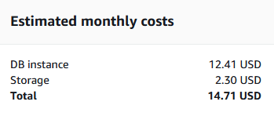


### 1.2 Cost of RDS vs EC2 comparison

The following EC2 estimate pricing has been calculated with the new [AWS Pricing Calculator](https://calculator.aws/#/). We chose this calculator because the [AWS simple monthly calculator](https://calculator.s3.amazonaws.com/index.html) will be retired (Friday, March 31, 2023).

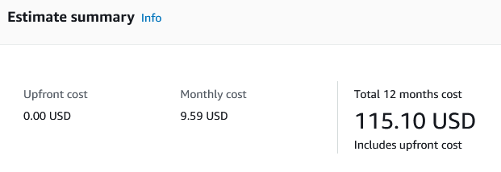

We can see that the RDS is more expensive that the corresponding EC2 instance (5.12 USD, so 30% more expensive). This difference can be explained by comparing the following table ([Source](https://docs.aws.amazon.com/AmazonRDS/latest/UserGuide/Welcome.html#Welcome.Concepts.RDS)) :

| Feature                     | Amazon EC2 management | Amazon RDS management |
| --------------------------- | --------------------- | --------------------- |
| Application optimization    | Customer              | Customer              |
| Scaling                     | Customer              | AWS                   |
| High availability           | Customer              | AWS                   |
| Database backups            | Customer              | AWS                   |
| Database software patching  | Customer              | AWS                   |
| Database software install   | Customer              | AWS                   |
| OS patching                 | Customer              | AWS                   |
| OS installation             | Customer              | AWS                   |
| Server maintenance          | AWS                   | AWS                   |
| Hardware lifecycle          | AWS                   | AWS                   |
| Power, network, and cooling | AWS                   | AWS                   |

We can see that a lot of feature is managed by AWS instead of the customer (fully managed), and this management has an extra cost. Now if we compare with on-premise management, it would be fully done by the user. So an IT manager would assume full responsibility for the server, operating system, and software.

### 1.3 RDS vs EC2 analysis 

#### Arguments in favor of RDS

RDS offers automatic backups and encryption. RDS takes full responsibility for the database. Configuration, management, maintenance, and security is automated by AWS. It allows to configure read replicas or set up synchronous replication across multiple AZ for enhanced performance and availability. It could be a huge time saver if we had to deploy a DB in multiple AZ with multiple stanbys, but time is money, so this solution is more expensive.  Inspired by this [Source](https://serverguy.com/comparison/pros-cons-rds-vs-ec2-mysql-aws/)

#### Arguments in favor of EC2 with DB engine

It gives more flexibility and granularity on various aspects of the system. for example, it is possible to choose a specific OS running a specific version, or you could use EBS RAID and stripping configurations for higher performance. It would be our only solution if we wanted to run a DB engine in an older unsupported version, or if the data access time and bandwith is critical. It could also be a cheaper choice for test/dev DB environment that do not need to be in production. Inspired by this [Source](https://serverguy.com/comparison/pros-cons-rds-vs-ec2-mysql-aws/)

In conclusion, it depends heavily on the needed DB flexibility, the nature of the data that is stored on the DB and the performance needed for the application. 

### 1.4 Database endpoint

````
gru-vanhove-drupal-db.c4ryp0xx1ffk.us-east-1.rds.amazonaws.com
````


## Configure Drupal instance to use the RDS DB

In this part we had to migrate the drupal DB from our EC2 instance to the RDS instance

## Deliverable 2

2.1 Copy the part of **settings.php** that configures the database into the report.

```
$databases['default']['default'] = array (
  'database' => 'drupal',
  'username' => 'kali',
  'password' => 'Q5v9uj9AiKnFhfhdGbaXCAkpj',
  'prefix' => '',
  'host' => 'gru-vanhove-drupal-db.c4ryp0xx1ffk.us-east-1.rds.amazonaws.com',
  'port' => '3306',
  'namespace' => 'Drupal\\Core\\Database\\Driver\\mysql',
  'driver' => 'mysql',
);
```


## Part 3 : Create a custom virtual machine image

In this part we had to create an image of our EC2 instance. This image will be used later to create new instances with the exact same configuration.

## Deliverable 3

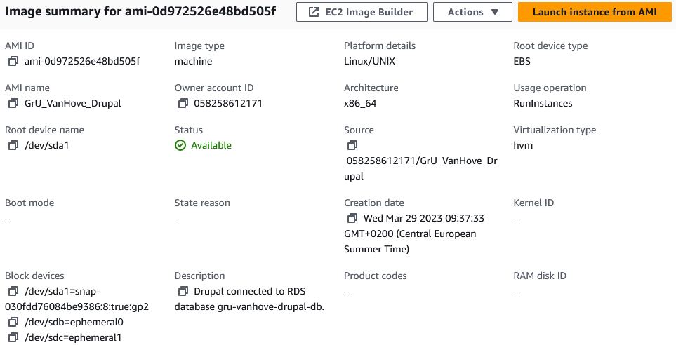

## Part 4 : Create a load balancer

In this part we had to create an AWS load balancer that receive the HTTP requests from clients and forward them to the Drupal instances.

## Deliverable 4

1. resolved IP addresses (A Record) from the DNS name of the load balancer

```
nslookup GrU-VanHove-LoadBalancer-37568843.us-east-1.elb.amazonaws.com
Server:  UnKnown
Address:  2001:730:3e82::13

Non-authoritative answer:
Name:    GrU-VanHove-LoadBalancer-37568843.us-east-1.elb.amazonaws.com
Addresses:  34.238.65.232
          35.172.196.179
```

2. Load balancer health check access from the Apache access logs:

```
172.31.10.38 - - [29/Mar/2023:07:59:30 +0000] "GET / HTTP/1.1" 200 3440 "-" "ELB-HealthChecker/2.0"
172.31.86.211 - - [29/Mar/2023:07:59:36 +0000] "GET / HTTP/1.1" 200 3440 "-" "ELB-HealthChecker/2.0"
```

## Part 5 : Lauch a second instance from the custom image

In this task we had to launch a second Drupal instance and connect it to the load balancer.

## Deliverable 5

1. Here is the diagram representing our cloud architecture:

   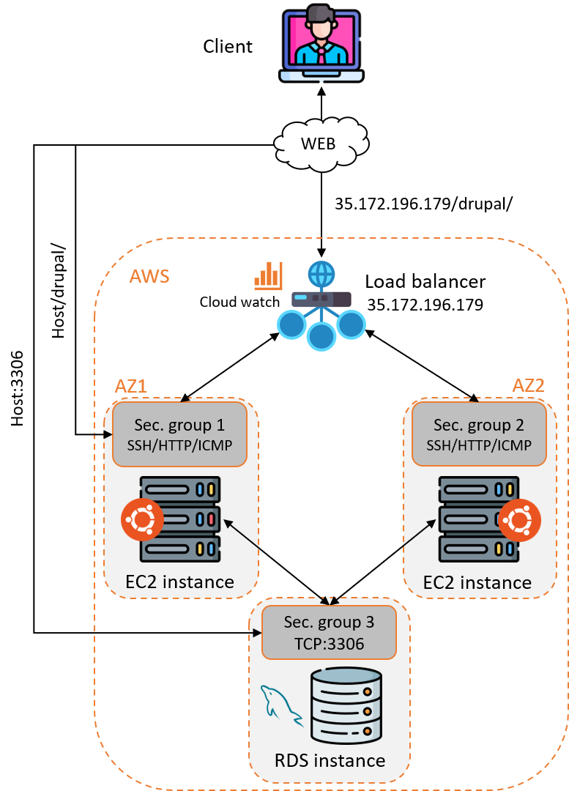

   Note that in the diagram, we can see that the 2 EC2 instances are in different availability zones. This is not the case in our configuration, they are in the same AZ. We simply wanted to show that it could be the case as we configured our load balancer to be able to redirect the traffic from 2 different ones.

2. Here is the estimated monthly costs for using our setup, including the 2 EC2 instances, the elastic load-balancer and  the RDS instance. As asked in the lab we did it with the [Simple Monthly Calculator](http://calculator.s3.amazonaws.com/calc5.html), but this calculator will not be available after **Friday, March 31, 2023**.

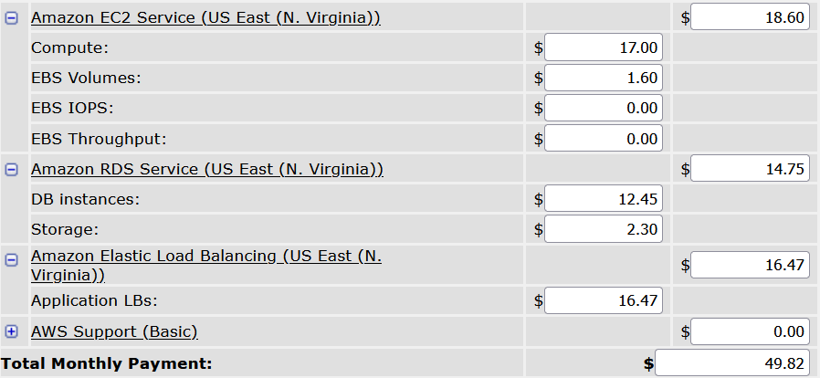

## Part 6 :  Test the distribued application

## Deliverables 6

### Configuration of JMeter

We except the number of threads, have configured jmeter as follows:

1. Thread Group: Ramp-up period: `1 second`, Loop Count: `1`
2. HTTP Request Defaults: ip of the load balancer : `34.238.65.232`
3. HTTP Cookie Manager: basic configuration
4. HTTP request: `GET` on `/drupal/`

So we send HTTP requests on the Drupal home page because we find interesting to see if the DB connexion will fail before the HTTP server.

The response time graphs are saved from JMeter. We didn't know how to resize the graphs to make them more readable.

### Environment

Please note that the following load tests have been done with a laptop on a WIFI connection, that adds a significant amount of latency in the requests and responses.

### Check that the load balancer works

We began to send 3 requests to the load balancer to see if the requests are sent to our 2 different instances.

Instance 1:

```
172.31.86.211 - - [29/Mar/2023:14:23:07 +0000] "GET /drupal/ HTTP/1.1" 200 10264 "-" "Apache-HttpClient/4.5.13 (Java/17.0.6)"
```

Instance 2: 

```
172.31.86.211 - - [29/Mar/2023:14:23:07 +0000] "GET /drupal/ HTTP/1.1" 200 10264 "-" "Apache-HttpClient/4.5.13 (Java/17.0.6)"
172.31.86.211 - - [29/Mar/2023:14:23:07 +0000] "GET /drupal/ HTTP/1.1" 200 10264 "-" "Apache-HttpClient/4.5.13 (Java/17.0.6)"
```

So we can see that the load is balanced between our 2 instances. Furthermore, during our tests, we can see that the CPU usage of the 2 instances are increasing proportionally on both instances:

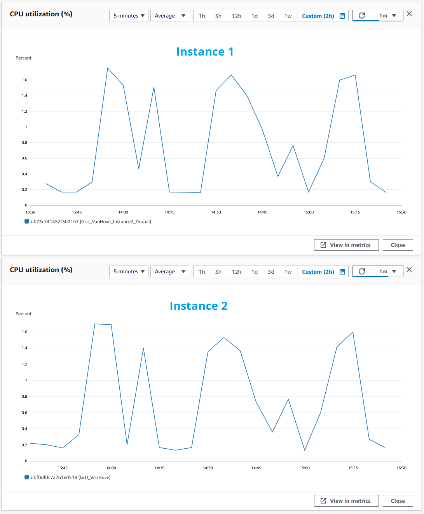

------


### 100 users

Until 100 threads, nothing special to see. The servers seem to handle the charge well.

| # Requests | Average RT [ms] | Median RT [ms] | Min RT [ms] | Max RT [ms] | % error |
| ---------- | --------------- | -------------- | ----------- | ----------- | ------- |
| 100        | 709             | 254            | 234         | 1450        | 0       |

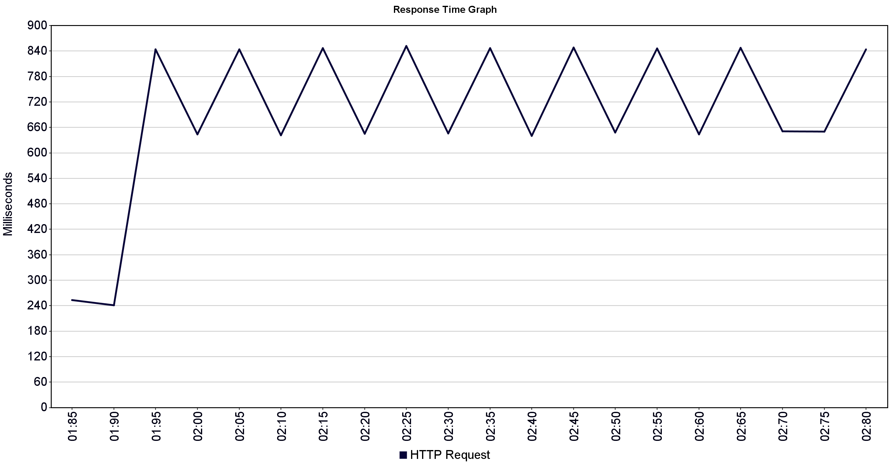


With more and more connection we begin to see those logs:

```
::1 - - [29/Mar/2023:14:35:17 +0000] "OPTIONS * HTTP/1.0" 200 126 "-" "Apache/2.4.29 (Ubuntu) (internal dummy connection)"
```

Apparently, those "dummy" connections are the way Apache tells its child processed that the have to die, so this is not really errors not errors.

------


### 200 users

At 200 threads, we begin to see a bigger response time (RT).  However, the server seems to process correctly all the incoming requests, because we have 0% of error packets.


| # Requests | Average RT [ms] | Median RT [ms] | Min RT [ms] | Max RT [ms] | % error |
| ---------- | --------------- | -------------- | ----------- | ----------- | ------- |
| 200        | 2817            | 1261           | 234         | 7358        | 0       |

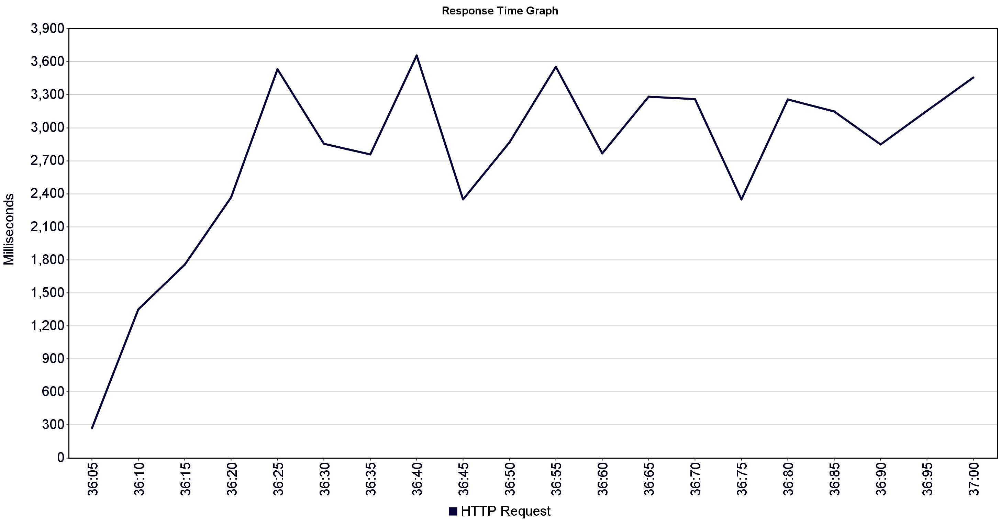

------


### 400 users

at 400 threads, The number of errors increased to reach 25%. The response time begin to be very high, with a median RT at 7.2 seconds.

| # Requests | Average RT [ms] | Median RT [ms] | Min RT [ms] | Max RT [ms] | % error |
| ---------- | --------------- | -------------- | ----------- | ----------- | ------- |
| 400        | 9407            | 7264           | 233         | 21063       | 25      |

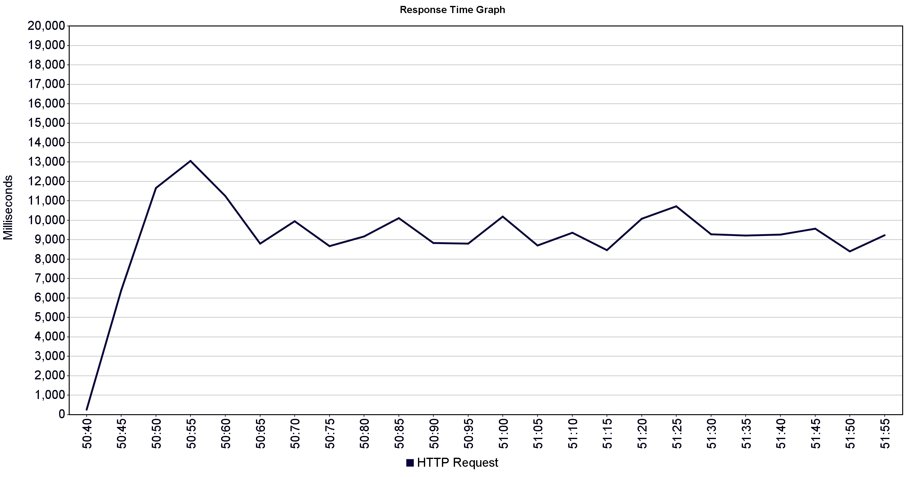

------


### 800 users

At 800 threads, we can clearly see that the response time is no longer viable, with a median at 17 seconds. The servers can not handle the throughput, as we can see 73% of error responses.

| # Requests | Average RT [ms] | Median RT [ms] | Min RT [ms] | Max RT [ms] | % error |
| ---------- | --------------- | -------------- | ----------- | ----------- | ------- |
| 800        | 16838           | 17044          | 234         | 21079       | 73      |

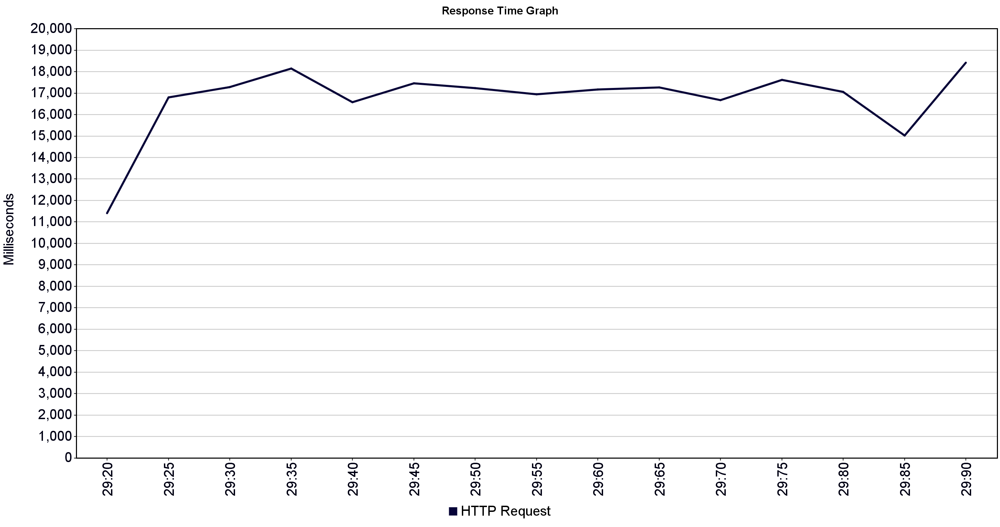


------


### Intriguing log

We have seen one very strange log. apparently somebody make requests on our servers.

```
172.31.86.211 - - [29/Mar/2023:14:33:49 +0000] "GET / HTTP/1.1" 200 11173 "-" "Hello World"
```

------


### ns-lookup

When we resolve the DNS name of the load balancer into IP addresses we can see 2 different Ip addresses associated with the DNS A record.

```
Non-authoritative answer:
Name:    GrU-VanHove-LoadBalancer-37568843.us-east-1.elb.amazonaws.com
Addresses:  34.238.65.232
          35.172.196.179
```

Interestingly, just after a load test, when we checked again ns-lookup, we observed that the order of the ip addresses were different.

```
Non-authoritative answer:
Name:    GrU-VanHove-LoadBalancer-37568843.us-east-1.elb.amazonaws.com
Addresses:  35.172.196.179
          34.238.65.232
```

