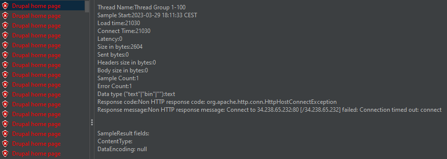
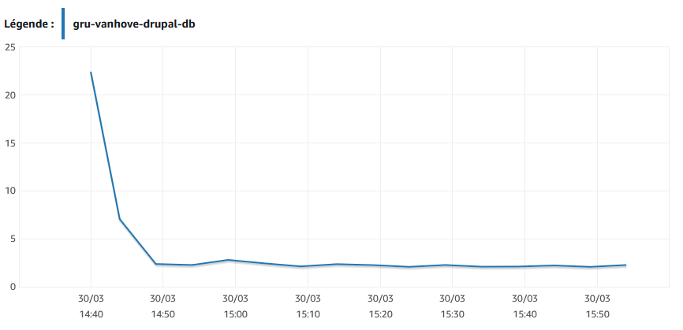
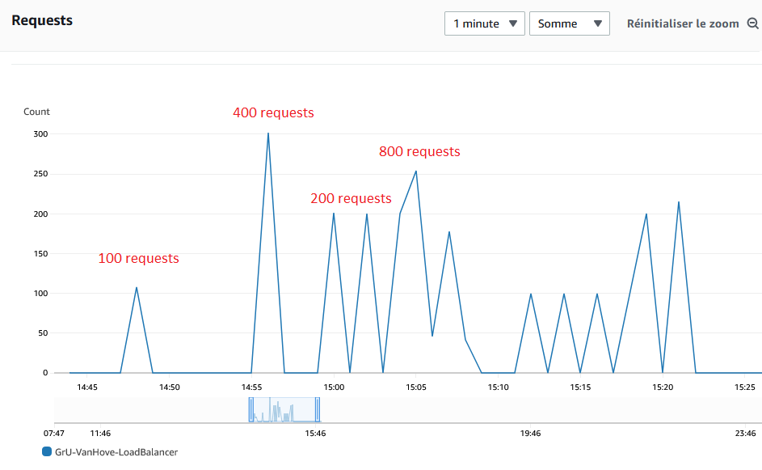

# CLD - LAB02 : App Scaling On Amazon Web Services

**Group U : A. David, T. Van Hove**

**Date : 06.04.2023**

**Teacher : Prof. Marcel Graf**

**Assistant : Rémi Poulard**

## Table of contents

[TOC]


## Introduction

This document contains all the deliverables for Laboratory #2 of the CLD course. We will not include the precise procedure followed by our group during the lab; however, we will discuss some elements and configurations related to this laboratory.

During this lab, we will create an RDS instance that runs MySQL. Then, we will migrate the Drupal database from our EC2 instance to the RDS instance. After that, we will create a load balancer to balance the traffic between two of our EC2 instances. Finally, we will perform some load tests with JMeter and discuss the results.

## Part 1: Create a database using RDS

For this task, we were required to create and configure an AWS RDS instance running MySQL version 8.0.27.

## Deliverable 1

### 1.1 Estimated monthly cost for the database

Firstly, we will explore some of the features available when choosing an AWS RDS instance.

#### On demand vs reserved RDS instances

> In terms of compute options and configurations, Reserved Instances and On Demand instances are the same. The only difference between the two is that a Reserved Instance is one you rent (“reserve”) for a fixed duration, and in return you receive a discount on the base price of an On Demand instance.
>
> The issue with AWS On Demand vs. Reserved Instance Pricing is that Standard Reserved Instance pricing is fixed. If prices are reduced during the life of a one or three year contract (as they have been year-on-year during the past decade), customers see no benefit from the price reduction and are committed to paying the Reserved Instance price for the duration of the contract.
>
>  [Source](https://blogs.vmware.com/cloudhealth/aws-reserved-instances-vs-on-demand/)

Our RDS instance is an on demand one.

#### DB instance classes

The computation and memory capacity of an Amazon RDS DB instance are determined by its DB instance class, which comprises the DB instance type and size. For this project, we selected the db.t3.micro instance class, which offers a baseline performance level with the ability to burst to full CPU usage. These instance classes provide greater computing capacity than the earlier db.t2 instance classes, and they are powered by the AWS Nitro System, a combination of dedicated hardware and a lightweight hypervisor.

#### Single vs Multi AZ deployment

> Failures are rare, but as a best practice, applications should design around potential failures. The RDS Multi-AZ configuration is the recommended approach for production environments due to its ability to support low *RTO* (recovery time objective) and *RPO* (recovery point objective) requirements. RTO is the targeted amount of time for a recovery to complete in the event of failure. RPO is the targeted amount of time during which data is at risk for loss in the event of a failure.
>
> [Source](https://aws.amazon.com/blogs/database/amazon-rds-under-the-hood-single-az-instance-recovery/)

> In an Amazon RDS Multi-AZ deployment, Amazon RDS automatically creates a primary database (DB) instance and synchronously replicates the data to an instance in a different AZ. When it detects a failure, Amazon RDS automatically fails over to a standby instance without manual intervention.
>
> 
>
> [Source](https://aws.amazon.com/rds/features/multi-az/)

Furthermore, it is possible to deploy RDS Multi-AZ with two readable standbys, allowing for two standby DB instances to serve as failover targets and handle read traffic. This configuration can result in up to 2x faster transaction commits compared to Amazon RDS Multi-AZ with only one standby.

On the other hand, in a single-AZ deployment, there are no automatic failover mechanisms in place.

You can watch an introduction video to RDS multi-AZ [here.](https://youtu.be/_MROZtLtCcA)

#### Pricing

The following estimated pricing is given when creating the RDS instance.

| Qty  | Instance type | Deployment option | Storage type | Storage capacity | Backup storage |
| ---- | ------------- | ----------------- | ------------ | ---------------- | -------------- |
| 1    | db.t3.micro   | Single AZ         | gp2          | 20GB             | no             |


### 1.2 Cost of RDS vs EC2 comparison

The following EC2 estimate pricing has been calculated with the new [AWS Pricing Calculator](https://calculator.aws/#/). We chose this calculator because the [AWS simple monthly calculator](https://calculator.s3.amazonaws.com/index.html) will be retired (Friday, March 31, 2023).


It's evident that the RDS is more expensive than the corresponding EC2 instance, with a cost of 5.12 USD, making it approximately 30% more expensive. This cost difference can be attributed to factors outlined in the following table. ([Source](https://docs.aws.amazon.com/AmazonRDS/latest/UserGuide/Welcome.html#Welcome.Concepts.RDS)) :

| Feature                     | Amazon EC2 management | Amazon RDS management |
| --------------------------- | --------------------- | --------------------- |
| Application optimization    | Customer              | Customer              |
| Scaling                     | Customer              | AWS                   |
| High availability           | Customer              | AWS                   |
| Database backups            | Customer              | AWS                   |
| Database software patching  | Customer              | AWS                   |
| Database software install   | Customer              | AWS                   |
| OS patching                 | Customer              | AWS                   |
| OS installation             | Customer              | AWS                   |
| Server maintenance          | AWS                   | AWS                   |
| Hardware lifecycle          | AWS                   | AWS                   |
| Power, network, and cooling | AWS                   | AWS                   |

It's noticeable that many features are fully managed by AWS rather than the customer, and this management service comes with an additional cost. In comparison, on-premises management is fully handled by the user. An IT manager, in this case, would assume full responsibility for the server, operating system, and software.

### 1.3 RDS vs EC2 analysis 

#### Arguments in favor of RDS

RDS provides automatic backups and encryption, taking full responsibility for the database's configuration, management, maintenance, and security through AWS automation. This enables users to configure read replicas or set up synchronous replication across multiple AZs for improved performance and availability. While deploying a database in multiple AZs with multiple standbys can be time-consuming, it can be a huge time saver with RDS. However, time is money, and this solution is more expensive. Inspired by this [Source](https://serverguy.com/comparison/pros-cons-rds-vs-ec2-mysql-aws/)

#### Arguments in favor of EC2 with DB engine

It gives more flexibility and granularity on various aspects of the system. For instance, users can choose a specific OS running a specific version, or they could use EBS RAID and stripping configurations for higher performance. EC2 would be the only solution if a user wants to run a DB engine in an older unsupported version, or if data access time and bandwidth are critical. It could also be a cheaper choice for test/dev DB environments that do not need to be in production. Inspired by this [Source](https://serverguy.com/comparison/pros-cons-rds-vs-ec2-mysql-aws/)

In conclusion, the decision between RDS and EC2 with a DB engine heavily depends on the required flexibility of the database, the nature of the data stored, and the performance needed for the application.

### 1.4 Database endpoint

````
gru-vanhove-drupal-db.c4ryp0xx1ffk.us-east-1.rds.amazonaws.com
````


## Part 2: Configure Drupal instance to use the RDS DB

In this part, we were required to migrate the Drupal database from our EC2 instance to the RDS instance.

## Deliverable 2

Here is the copy of the part of **settings.php** that configures the database into the report.

```
$databases['default']['default'] = array (
  'database' => 'drupal',
  'username' => 'kali',
  'password' => 'Q5v9uj9AiKnFhfhdGbaXCAkpj',
  'prefix' => '',
  'host' => 'gru-vanhove-drupal-db.c4ryp0xx1ffk.us-east-1.rds.amazonaws.com',
  'port' => '3306',
  'namespace' => 'Drupal\\Core\\Database\\Driver\\mysql',
  'driver' => 'mysql',
);
```


## Part 3 : Create a custom virtual machine image

In this part, we had to create an image of our EC2 instance. This image will be utilized later to create new instances with the exact same configuration.

## Deliverable 3

Here is the screenshot of the AWS console showing the AMI parameters.


## Part 4 : Create a load balancer

In this part, we had to create an AWS load balancer that receives HTTP requests from clients and forwards them to the Drupal instances.

## Deliverable 4

1. resolved IP addresses (A Record) from the DNS name of the load balancer

```
nslookup GrU-VanHove-LoadBalancer-37568843.us-east-1.elb.amazonaws.com
Server:  UnKnown
Address:  2001:730:3e82::13

Non-authoritative answer:
Name:    GrU-VanHove-LoadBalancer-37568843.us-east-1.elb.amazonaws.com
Addresses:  34.238.65.232
          35.172.196.179
```

2. Load balancer health check access from the Apache access logs:

```
172.31.10.38 - - [29/Mar/2023:07:59:30 +0000] "GET / HTTP/1.1" 200 3440 "-" "ELB-HealthChecker/2.0"
172.31.86.211 - - [29/Mar/2023:07:59:36 +0000] "GET / HTTP/1.1" 200 3440 "-" "ELB-HealthChecker/2.0"
```

## Part 5 : Launch a second instance from the custom image

In this task we had to launch a second Drupal instance and connect it to the load balancer.

## Deliverable 5

1. Here is the diagram representing our cloud architecture:

   

   Please note that in the diagram, we can see that the two EC2 instances are located in different availability zones, but in our configuration, they are both in the same availability zone. We wanted to illustrate that our load balancer is capable of redirecting traffic from multiple availability zones. Additionally, our RDS is also located in the same availability zone (us-east-1b).

2. Here is the estimated monthly costs for using our setup, including the 2 EC2 instances, the elastic load-balancer and the RDS instance. As asked in the lab we did it with the [Simple Monthly Calculator](http://calculator.s3.amazonaws.com/calc5.html), but this calculator will not be available after **Friday, March 31, 2023**.


## Part 6 : Test the distribued application

## Deliverables 6

### Configuration of JMeter

Except the number of threads, have configured jmeter as follows:

1. Thread Group: Ramp-up period: `1 second`, Loop Count: `1`
2. HTTP Request Defaults: ip of the load balancer : `34.238.65.232`
3. HTTP Cookie Manager: basic configuration
4. HTTP request: `GET` on `/drupal/`
5. We used a response time graph, a restult tree and an aggregate report to study the results

### Environment

Please note that the following load tests were conducted using a low-end laptop with a Wi-Fi connection and through a VPN. This configuration introduces a significant amount of latency in the requests and responses.

### Check that the load balancer works

We began to send 3 requests to the load balancer to see if the requests are sent to our 2 different instances.

Instance 1:

```
172.31.86.211 - - [29/Mar/2023:14:23:07 +0000] "GET /drupal/ HTTP/1.1" 200 10264 "-" "Apache-HttpClient/4.5.13 (Java/17.0.6)"
```

Instance 2: 

```
172.31.86.211 - - [29/Mar/2023:14:23:07 +0000] "GET /drupal/ HTTP/1.1" 200 10264 "-" "Apache-HttpClient/4.5.13 (Java/17.0.6)"
172.31.86.211 - - [29/Mar/2023:14:23:07 +0000] "GET /drupal/ HTTP/1.1" 200 10264 "-" "Apache-HttpClient/4.5.13 (Java/17.0.6)"
```

So we can see that the load is balanced between our 2 instances. Additionally, we can observe from the chart below that the CPU usage of both instances is increasing proportionally:


### 100 users

Until 100 threads, nothing special to see. The servers seem to handle the charge well.

| # Requests | Average RT [ms] | Median RT [ms] | Min RT [ms] | Max RT [ms] | % error |
| ---------- | --------------- | -------------- | ----------- | ----------- | ------- |
| 100        | 709             | 254            | 234         | 1450        | 0       |


With more and more connection we begin to see those logs:

```
::1 - - [29/Mar/2023:14:35:17 +0000] "OPTIONS * HTTP/1.0" 200 126 "-" "Apache/2.4.29 (Ubuntu) (internal dummy connection)"
```

In Apache, internal dummy connections are created periodically to ensure that worker processes are still available to handle requests. This helps the server to avoid situations where all worker processes are tied up with long-running requests, and new requests cannot be processed until the long-running requests are completed. When Apache creates an internal dummy connection, it behaves like any other client, sending an HTTP request to the server and waiting for a response. Once the response is received, the connection is closed.


### 200 users

At 200 threads, we begin to see a bigger response time (RT). However, the server seems to process correctly all the incoming requests, because we have 0% of error packets.


| # Requests | Average RT [ms] | Median RT [ms] | Min RT [ms] | Max RT [ms] | % error |
| ---------- | --------------- | -------------- | ----------- | ----------- | ------- |
| 200        | 2817            | 1261           | 234         | 7358        | 0       |


### 400 users

at 400 threads, The number of timed-out requests increased to reach 25%. The response time begin to be high, with a median RT at 7.2 seconds.

| # Requests | Average RT [ms] | Median RT [ms] | Min RT [ms] | Max RT [ms] | % error |
| ---------- | --------------- | -------------- | ----------- | ----------- | ------- |
| 400        | 9407            | 7264           | 233         | 21063       | 25      |


### 800 users

At 800 threads, we can clearly see that the response time is no longer viable, with a median at 17 seconds. The servers can not handle the throughput, as we can see 73% of timed-out requests.

| # Requests | Average RT [ms] | Median RT [ms] | Min RT [ms] | Max RT [ms] | % error |
| ---------- | --------------- | -------------- | ----------- | ----------- | ------- |
| 800        | 16838           | 17044          | 234         | 21079       | 73      |


### Errors received

Every error that we received is a `Connection timed out` , it means that for a request sent, Jmeter did not receive a response from the server.

 


### Bottleneck of the system

It is interesting to see that the CPU usage of our 2 instances is very low in spite of the bad response time ([see the CPU load graph here](#Check-that-the-load-balancer-works)). It indicates that this is not the bottleneck of our system. Furthermore, we can see in the graphs below that the UC usage of our RDS instance is also very low (the peek at the beginning is the instance starting up).



Now what is interesting, is the number of the requests received by the load balancer. The text in red indicates the number of requests sent from our laptop.



In the graph above, we can clearly see that the load balancer does not receive the amount of requests that we sent. We can see in the following table, that the % of timed-out requests is equivalent to the % of errors in JMeter.

| Sent requests | Received requests | % loss |
| ------------- | ----------------- | ------ |
| 100           | 100               | 0%     |
| 200           | 200               | 0%     |
| 400           | 300               | 25%    |
| 800           | 250               | 68%    |

We can conclude that the load balancer works fine, but a great amount of the requests sent to it, is lost, or somehow dropped before reaching the ELB.


### Intriguing log

We have seen one very strange log. apparently somebody make requests on our servers.

```
172.31.86.211 - - [29/Mar/2023:14:33:49 +0000] "GET / HTTP/1.1" 200 11173 "-" "Hello World"
```


### ns-lookup

When we resolve the DNS name of the load balancer into IP addresses we can see 2 different Ip addresses associated with the DNS A record.

```
Non-authoritative answer:
Name:    GrU-VanHove-LoadBalancer-37568843.us-east-1.elb.amazonaws.com
Addresses:  34.238.65.232
          35.172.196.179
```

Interestingly, just after a load test, when we checked again ns-lookup, we observed that the order of the ip addresses were different.

```
Non-authoritative answer:
Name:    GrU-VanHove-LoadBalancer-37568843.us-east-1.elb.amazonaws.com
Addresses:  35.172.196.179
          34.238.65.232
```

The order of the IP addresses returned by the DNS resolver may change from time to time because the DNS uses round-robin load balancing to distribute the incoming traffic among the available endpoints. The DNS resolver may rotate the order of the IP addresses returned for the same DNS name on each query to spread the traffic across all endpoints equally.

### Tests conclusion

We can observe that with 400 and 800 requests, time-outs occur and the response time becomes too high for a good user experience. Additionally, we noticed that the ELB does not receive all requests, and in the graphs, the CPU load of our 2 EC2 instances and RDS instance barely exceeds 1.6% and 3%, respectively. Based on the results we obtained, it appears that our configuration has two major bottlenecks:

1. The first bottleneck is clearly the response time-outs that are caused outside of the AWS network. This may be linked to test environment limitations, such as the laptop's wireless NIC, VPN capabilities, or the school network. We must also emphasize that the AWS regions are far away from Switzerland.
2. The second bottleneck may be inside the AWS infrastructure. Although the ELB and EC2 instances have no problem responding to incoming requests, the limitations may lie with the network interfaces of our EC2 instances that cannot keep up with the traffic and add more latency. This bottleneck may also be caused by the limitations of the laptop's wireless NIC, VPN capabilities, and the school network, which add more response latency as traffic increases.

Regarding load balancing, our configuration effectively tests the load balancing mechanism of our Application Load Balancer by distributing traffic among our EC2 instances. However, this simple test has limitations, as it does not take into account the diversity of traffic patterns that may occur in a real-world scenario, and it is limited to a specific set of test conditions. To fully test the system's performance and identify any potential issues or bottlenecks, a more diverse set of tests that simulate real-world scenarios would be necessary.

To perform realistic testing, we could use different types of requests, varying the frequency and intensity of requests, and simulating different user behaviours and patterns. Additionally, we could consider testing the system under different conditions, such as during peak traffic hours or with high levels of concurrent users.
